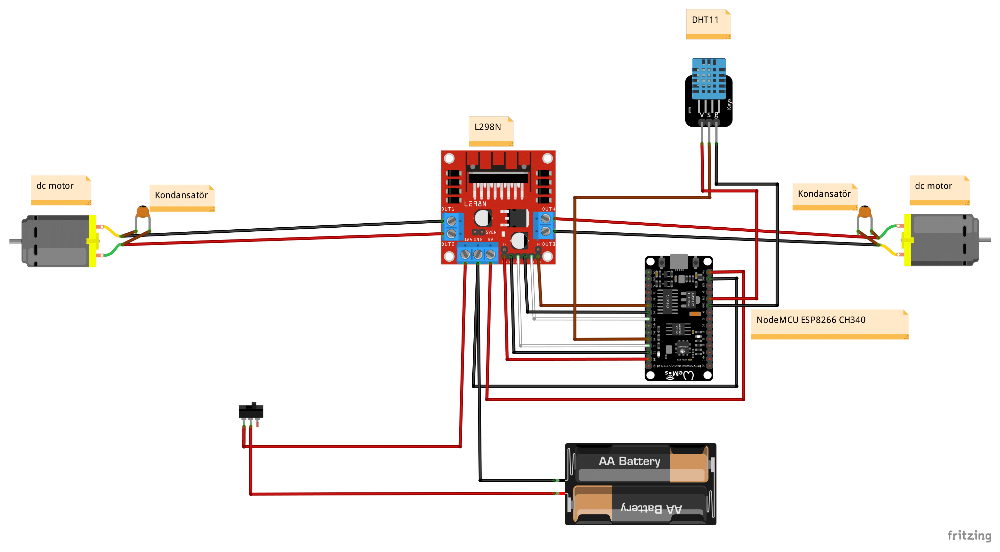
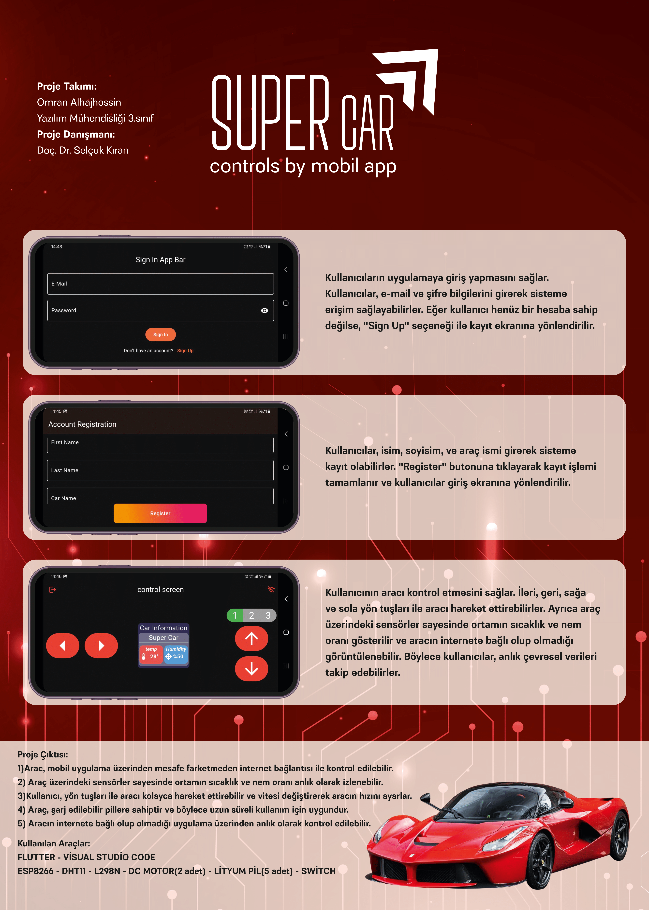
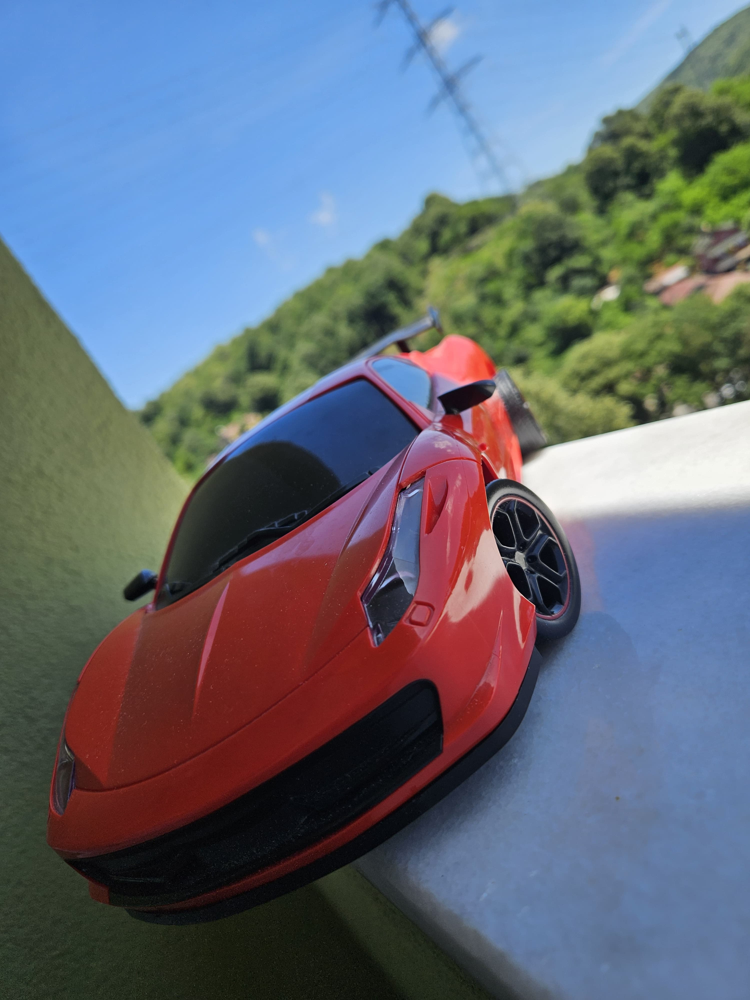
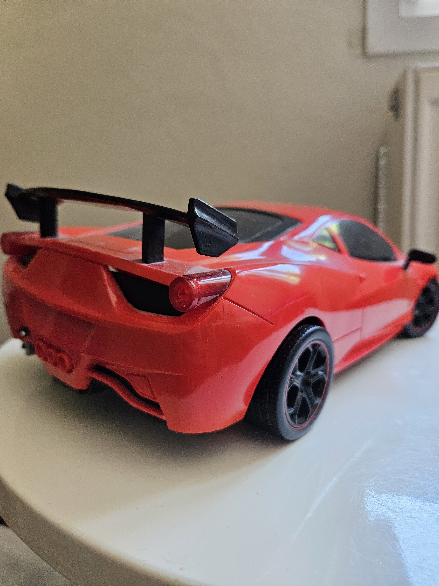

# 🚗 Super Car (Mobil Uygulama Entegrasyonu ile)

## 📌 Proje Amacı
Bu projenin amacı, bir aracı mesafe fark etmeksizin kontrol edebilmek ve bulunduğu ortamın sıcaklık ve nem oranını ölçmektir. Mobil uygulama entegrasyonu sayesinde kullanıcı, aracı istediği yerden yönetebilir ve çevresel koşulları anlık olarak izleyebilir.

## 📖 Proje Özeti
Super Car projesi, bir akıllı araç ve mobil uygulama entegrasyonunu kapsamaktadır. Araç ile mobil uygulama arasında iletişim, **Firebase Realtime Database** üzerinden sağlanmaktadır.  
Kullanıcılar:
- Araç 4 farlı vites(1-2-3-R) seçeneği ile uzaktan yönlendirilebilir
- Ortam sıcaklığı ve nem oranlarını gerçek zamanlı görebilir

## 🔧 Kullanılan Donanımlar
- **NodeMCU ESP8266:** Wi-Fi modülü
- **L298N:** Motor sürücü modülü
- **DHT11:** Sıcaklık ve nem sensörü
- **DC Motor (2 adet)**
- **Şarj edilebilir lityum pil (5 adet)**
- **Mercimek kondansatör**
- **Switch anahtar**
- **Kablolar ve lastikler (4 adet)**

## ⚙️ Teknik Detaylar
- Araç ilk kez çalıştırıldığında, daha önce bir ağa bağlanmamışsa kendisini bir **access point** olarak gösterir.
- Kullanıcı bu ağa bağlanarak Wi-Fi yapılandırmasını tamamlar.
- Eğer araç önceden bir ağa bağlandıysa, çalıştırıldığında otomatik olarak tanıdığı ağa bağlanır.
- Veri iletişimi Firebase üzerinden sağlanır, bu sayede mobil uygulama ile gerçek zamanlı kontrol ve veri izleme mümkündür.

## 📱 Mobil Uygulama
- Mobil uygulama Flutter ile geliştirilmiştir (varsayım)
- Firebase Realtime Database ile entegre çalışır
- Kullanıcı arayüzü üzerinden yön, sıcaklık ve nem bilgileri görüntülenebilir

## 🔌 Devre Şeması
Devre şeması aşağıdaki gibidir:

## Poster

  
  

## 👤 Geliştirici
**Omran Alhajhossin**  
📧 Email: omran.haj20@gmail.com  
🔗 LinkedIn: [linkedin.com/in/omran-alhajhossin-b1630727b](https://linkedin.com/in/omran-alhajhossin-b1630727b)
